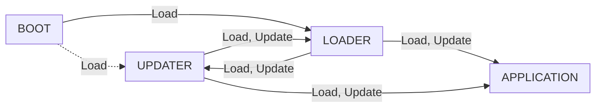

# STM32F4 Multi-Stage Bootloader System

A robust, multi-stage bootloader system for STM32F4 microcontrollers with secure firmware updates and validation.

## Architecture Overview

This bootloader system consists of four main components residing in specific flash memory regions:

1. **Boot**: First-stage bootloader that validates and loads either Loader or Updater.
2. **Loader**: Main bootloader with XMODEM update capability for Application and Updater.
3. **Updater**: Similar to Loader but can also update the Loader itself.
4. **Application**: The user firmware that runs the actual application.

Each component features a structured header (0x200 bytes) containing metadata such as magic number, version, CRC checksum, and vector table address.

### Boot Sequence Flow



## Security and Safety Measures

### Firmware Validation
- **Magic Number Verification**: Each component has a unique magic identifier in its header.
- **CRC Validation**: Firmware integrity is verified using CRC32 checksums.
- **Version Control**: The system ensures new firmware has a higher version than existing firmware.

### Flash Memory Protection
- **Controlled Flash Operations**: All flash operations include proper error handling and validation.
- **Sector-Based Updates**: Flash is updated in sectors to minimize the risk of partial or corrupted updates.
- **Pre-Update Verification**: Headers are validated before erasing any flash sectors.

### Boot Safety Mechanisms
- **Fallback Boot Process**: If the primary Loader is corrupted, the system falls back to the Updater.
- **Peripheral Reset**: Proper peripheral de-initialization before jumping between components.

### Update Process Protection
- **XMODEM Protocol**: Uses reliable XMODEM protocol with CRC-16 verification for firmware updates.
- **Timeout Management**: Proper timeouts during updates prevent the system from getting stuck.
- **Visual Indicators**: LED feedback for system status, update progress, and error conditions.

## Memory Layout

```
Flash Memory:
0x08000000 +---------------+
           | Boot (16KB)   |
0x08004000 +---------------+
           | Loader (16KB) |
0x08008000 +---------------+
           | Updater (16KB)|
0x08020000 +---------------+
           | Application   |
           | (384KB)       |
0x08080000 +---------------+

RAM:
0x20000000 +---------------+
           | Main RAM      |
           | (128KB)       |
0x20020000 +---------------+

CCMRAM:
0x10000000 +---------------+
           | CCM RAM       |
           | (64KB)        |
           | Shared Memory |
0x10010000 +---------------+
```

### Component Headers (0x200 bytes each)
Each firmware component begins with a header containing:
- Magic number (unique per component type)
- Version information (major.minor.patch)
- Image type identifier
- Vector table address
- CRC checksum of the firmware
- Data size

## Build and Flash Instructions

### Prerequisites
- Rust toolchain with `thumbv7em-none-eabihf` target
- `cargo-binutils` for binary generation
- `probe-rs` for flashing
- Python 3.x for running the merge script

### Building the Project
```bash
# Build all components in release mode
./build.ps1 release

# Build and flash
./build.ps1 release flash

# Build in debug mode
./build.ps1 debug
```

### Flashing Individual Components
```bash
# Flash the entire firmware
probe-rs download --chip STM32F407VGTx --binary-format bin --base-address 0x08000000 merged_firmware.bin

# Flash individual components
probe-rs download --chip STM32F407VGTx --binary-format bin --base-address 0x08000000 boot.bin
probe-rs download --chip STM32F407VGTx --binary-format bin --base-address 0x08004000 loader.bin
probe-rs download --chip STM32F407VGTx --binary-format bin --base-address 0x08008000 updater.bin
probe-rs download --chip STM32F407VGTx --binary-format bin --base-address 0x08020000 application.bin
```

### Firmware Updates via XMODEM
1. Connect to the device via UART (115200 baud)
2. Select firmware update option from the menu
3. Choose the target component to update
4. Use terminal applications like TeraTerm or ExtraPuTTY in order to send the firmware binary using XMODEM protocol with CRC16 checking
5. After successful transfer, the system will automatically return to the menu (or if ithe home interface fails to update, just press 'Esc' as the hint says)

## Project Structure

```
├── boot/                  # First-stage bootloader
├── loader/                # Main bootloader
├── updater/               # Updater bootloader
├── application/           # Example application
├── stm32f4/               # STM32F4 peripheral access crate
├── misc/                  # Shared library components
│   ├── src/
│   │   ├── bootloader.rs  # Common boot code
│   │   ├── flash.rs       # Flash memory operations
│   │   ├── image.rs       # Firmware image definitions
│   │   ├── ring_buffer.rs # UART buffer implementation
│   │   ├── systick.rs     # System tick utilities
│   │   └── xmodem.rs      # XMODEM protocol implementation
├── scripts/               # Build and utility scripts
└── build.ps1              # Main build script
```

## Safety Considerations

### Preventing Bricking
- The Boot component never gets updated (preserved)
- Multiple validation checks before any flash operations
- Fallback to Updater if Loader is corrupted

### Update Integrity
- Complete CRC verification of firmware images
- Proper sequence checking during XMODEM transfers
- Error handling for timeout and communication failures
- Version comparison prevents downgrading

### System Stability
- Proper peripheral initialization/de-initialization
- Memory management with stack pointer validation
- Interrupt handling and critical section protection
- Clean jump procedures between components
